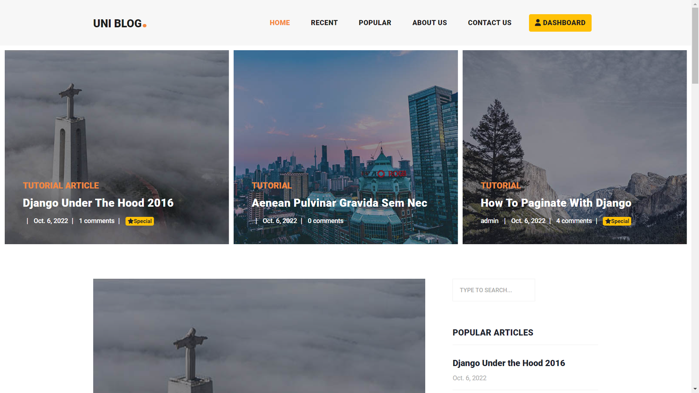
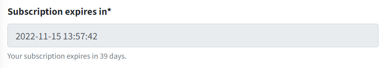

# ِDjango Blog

> A Blog developed using Django framework along with a fully customized Management Panel

### UNI BLOG is up and running on UUWN's network and it's accessible at [This Address](https://192.168.116.176:8000).

## Screenshots

# Features

A little about DjangoBlog:

* Used view counter to determine popular articles
* Customized admin panel for superusers
* Fully functional management panel with [AdminLte3](https://adminlte.io/) for SuperUsers, Staff, Authors and regular
  users
* Special articles and subscription
* Signup with E-mail confirmation
* Reset password with E-mail
* Authentication with Google
* Easy share on social media(Twitter, Telegram, Whats app)
* Search bar
* Comment system
* Authorized access to privileged sections

## View Counter

---
Let's say you want to read an article on DjangoBlog. The second you open the article a middleware saves your IP address
and count it as a view for that article. Stored ip addresses are accessible from django's admin panel.

## Management Panel

---
This panels template is from [Adminlte3](https://adminlte.io/), also
with [django crispy forms](https://django-crispy-forms.readthedocs.io/en/latest/#), all forms are supported by
bootstrap4.

*Articles list*

*New article*

*Comments list*

*User Profile*

*Change Password*

## Privileges

---

Privileges and Restricted access are very important matters, so I took them seriously. If someone wants to bypass the
restrictions, will get 404 error or redirects to main page.

On the blog, sending comment and access to special articles requires login. On management panel privileges are a little
more complicated and is as follows:

If you are an active regular or special user you only can access your own profile and change only your Firstname,
Lastname, email and password.

If you are designated as author(author status can set from admin panel by superuser) in addition of futures above:

- Articles: you can add, change, delete(with double confirmation), see preview. Also, as an author you only can submit
  your article for review, and you can't put it on blog directly; your article will be reviewed by staff or superusers.

- comments: you can read and set status(accept or deny) your own articles comments in this case if you deny a comment it
  will delete automatically.

If you are staff (staff status can set from admin panel by superusers) in addition of futures above you have full access
to:

- Articles: add, full modify, delete, set status(accept or deny)

- Comments: see comments and replies in tree view, delete, set status(accept or deny)
  in this case if you deny a comment it will delete automatically.

If you are a superuser... well naturally you can do what the hell you want here and ofcourse from admin panel.

## Special membership

---

Every user has a subscription date, after that date user's special membership will expire and reading special articles
requires special membership without it, user will see only the first 50 words of the text.

*subscription*

.png)
*subscription expired*

.png)
*see more*

## Contributors

@AlirezaAbavi @LovemanAmir @Romihkh @farrinwings99 @ZarhaJnti @masumehkarimi

## Credits

Thank you to the following awesome geeks for their templates and packages ❤️

* Management Panel Template: [Adminlte3](https://adminlte.io/)

## License

This project is licensed under the MIT License - see the LICENSE.md file for details

MIT © AlirezaAbavi